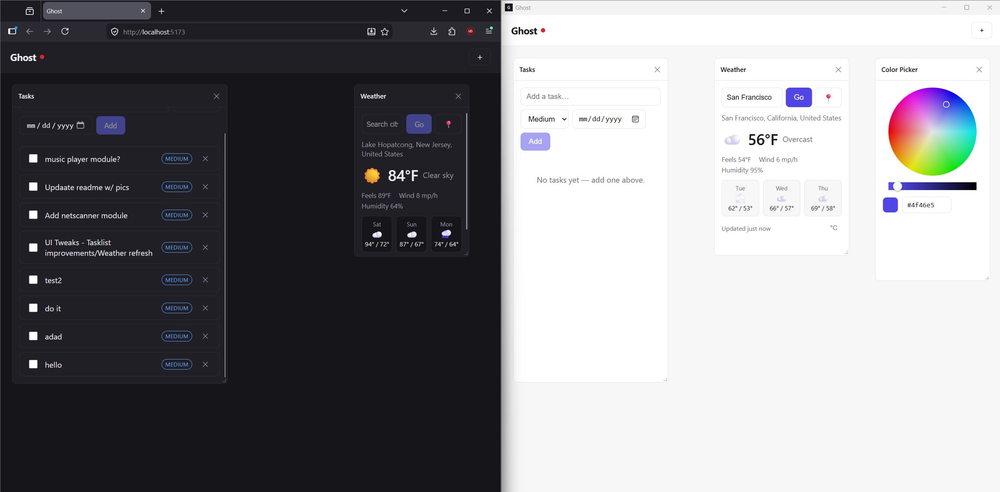
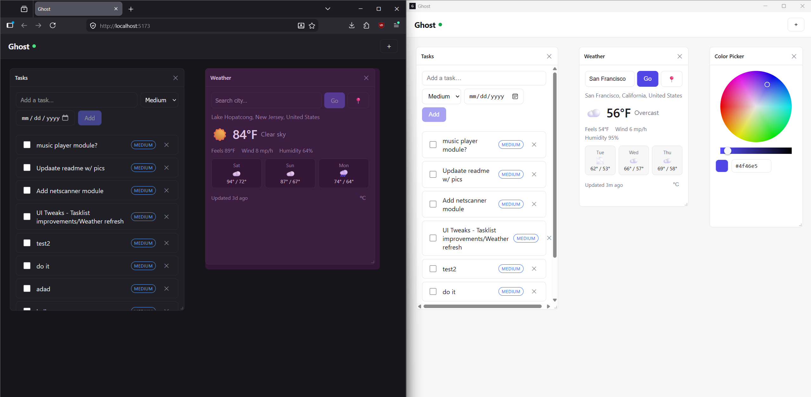

# Ghost

Ghost is a local-first personal assistant for your tasks, finances, and daily
responsibilities, with an AI agent that can act on them for you. Your data lives
on your own devices and works fully offline, then syncs across them when you
reconnect.

## What it does

- Keeps a full copy of your data on every device, so it works offline and syncs
  in the background once you're back online.
- Runs a tool-calling AI agent that can create tasks, read your calendar, and
  check balances on your behalf.
- Brings tasks, scheduling, finances, and third-party integrations together in
  one app.

## How it's built

One headless backend serves thin clients that share its types and sync stream:

```
   Web · Desktop · Mobile          (each with a local store, works offline)
            │
            │  REST + sync stream
            ▼
     Headless server               (modular monolith)
            │  OAuth + REST
            ▼
   Google · banking · model API
```

The stack is TypeScript throughout: React and Tauri on the clients, a Node sync
server, and local-first storage on SQLite. The server runs on better-sqlite3 for
now and will move to Postgres later.

For the full design, see [docs/ARCHITECTURE.md](docs/ARCHITECTURE.md), which
covers the two data planes, the tool registry, sync, and the reasoning behind
the stack. The delta-sync engine has its own writeup in
[docs/SYNC.md](docs/SYNC.md).

## Getting started

### Prerequisites

- Node 20 or newer and pnpm 9 or newer. The repo pins pnpm through the
  `packageManager` field, so `corepack enable` picks up the right version
  automatically.
- Only for the desktop app: a stable Rust toolchain and the platform webview
  (WebView2 on Windows, preinstalled on Windows 11; WebKitGTK on Linux;
  WKWebView on macOS). The web app does not need these.

### Install

```
pnpm install
```

### Run

Start the web client and the sync server together (Turborepo runs both):

```
pnpm dev          # web on :5173, sync server on :3000
```

Run either half on its own:

```
pnpm --filter @ghost/web dev      # web only, the offline v0 with no server
pnpm --filter @ghost/server dev   # sync server only
```

Run it as a native desktop app, which wraps the same web UI in Tauri:

```
pnpm desktop         # dev window with hot reload
pnpm desktop:build   # native installers (.msi and .exe on Windows)
```

### Sync across devices

Every client keeps its own full SQLite store and works offline; the server only
reconciles them. To sync across machines on your LAN, copy
`apps/web/.env.example` to `apps/web/.env` and set `VITE_SERVER_URL` to the
host's address, for example `http://192.168.1.50:3000`. It defaults to
`http://localhost:3000`, which is what you want when everything runs on one
machine.

The screenshot below shows the web client next to a freshly opened desktop
client before their first sync. The web app already has tasks; the desktop store
is still empty.



After one sync round the desktop client has the same tasks as the web client,
and both status lights are green.



## Roadmap

The order ships something useful before taking on the hardest part, which is
sync.

- [x] Offline v0: web UI and local SQLite store, with tasks, weather, and the
      workspace canvas working on one device.
- [x] Sync: sync server and delta-sync engine, so it works across devices with
      last-write-wins.
- [x] Desktop: the web UI wrapped in Tauri, sharing the same local store.
- [ ] Agent and integrations: the tool registry and OAuth connectors for
      calendar, email, and banking.
- [ ] Mobile: reuse the API and shared types.

## Security & privacy

OAuth for every third-party integration, encrypted credentials, and an
append-only audit log of every agent action. See the security section of
[docs/ARCHITECTURE.md](docs/ARCHITECTURE.md) for details.

## License

To be determined.
